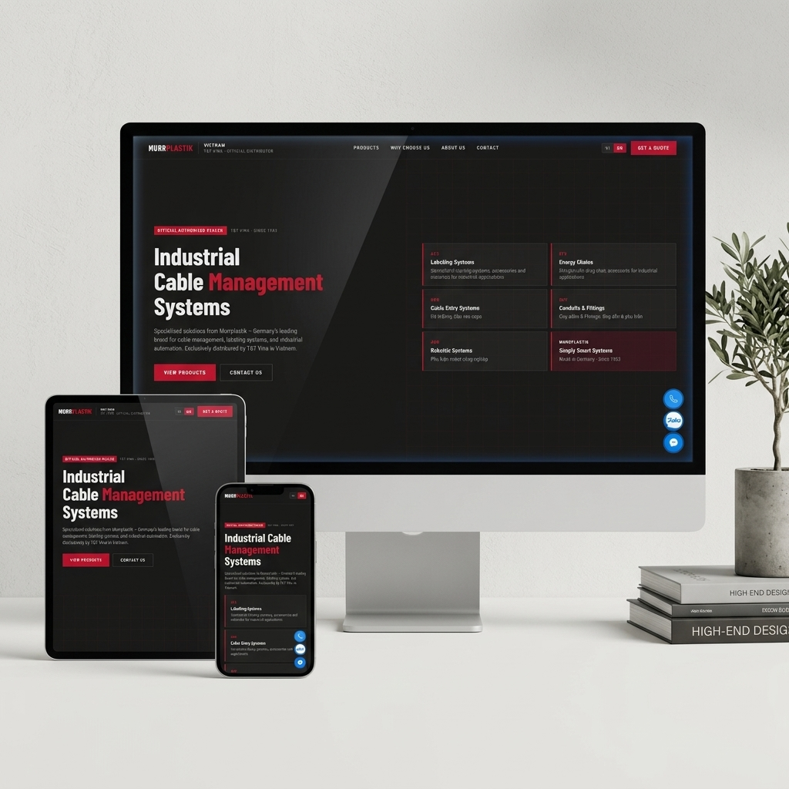

# Murrplastik Việt Nam ([murrplastikvn.com](https://murrplastikvn.com))

Dự án phát triển trang thông tin và giới thiệu sản phẩm chính thức của **Murrplastik** tại Việt Nam, đại lý phân phối ủy quyền bởi **T&T Vina Industrial Co., Ltd**.

Website chính thức: [https://murrplastikvn.com](https://murrplastikvn.com)



Trang web giới thiệu các giải pháp quản lý cáp, ống dẫn, máng xích nhựa, đầu vào cáp và phụ kiện robot hàng đầu từ tập đoàn Murrplastik GmbH (Đức).

---

## 🚀 Các Tính Năng Nổi Bật

### 1. Trải Nghiệm Người Dùng (UI/UX)
*   **Giao diện Hiện đại**: Phối màu đen/đỏ/xám đặc trưng thương hiệu Murrplastik, sử dụng font Barlow chuẩn SEO, hỗ trợ Responsive hoàn hảo trên Mobile, Tablet và Desktop.
*   **Popup CTA Khuyến mãi**: Popup quảng cáo thông minh kích hoạt tự động theo 3 phương thức: cuộn trang quá 25%, ở lại trang 10 giây, hoặc di chuyển chuột rời trang (Exit-Intent). Đi kèm cookie suppression giới hạn hiển thị 1 lần/ngày.
*   **Nút Quay về đầu trang**: Nút điều hướng "Back to Top" thiết kế bo tròn mượt mà, tự động hiển thị khi cuộn quá 50% trang.

### 2. Hệ Thống Đa Ngôn Ngữ (i18n)
*   Tích hợp đa ngôn ngữ Việt - Anh (VI/EN) thông qua engine `assets/js/i18n.js`.
*   Tự động lưu trạng thái lựa chọn ngôn ngữ qua `localStorage` (`mp_lang`).
*   Hỗ trợ dịch thuật toàn diện trên trang chủ và cả 5 trang con chi tiết sản phẩm bao gồm cả thẻ tiêu đề `<title>` và thẻ mô tả `<meta name="description">` chuẩn SEO.

### 3. Tối Ưu Hóa & Hiệu Năng (Performance)
*   **Hình ảnh thế hệ mới**: 100% hình ảnh sản phẩm và banner quảng cáo được tối ưu hóa sang định dạng `.webp` dung lượng thấp nhưng vẫn giữ nguyên độ sắc nét (Giảm tới hơn 93% dung lượng tải trang).
*   **Cấu hình máy chủ (.htaccess)**:
    *   Kích hoạt nén **Gzip** giảm dung lượng truyền tải mạng.
    *   Cấu hình **Browser Caching** lưu bộ nhớ đệm trình duyệt 1 năm cho ảnh, CSS và JS.
    *   **Cache Busting**: Sử dụng mã phiên bản `?v=1.4.0` tại các link liên kết tài nguyên để ép buộc trình duyệt cập nhật giao diện mới nhất.

### 4. Form Liên Hệ & Theo Dõi Chuyển Đổi
*   **Real-time Validation**: Kiểm tra định dạng Họ tên, Số điện thoại (VN), Email ngay khi nhập liệu.
*   **Google Sheets Integration**: Gửi dữ liệu yêu cầu báo giá trực tiếp về bảng tính Google Sheets thông qua API Google Apps Script.
*   **Đo lường chuyển đổi**: Tích hợp sự kiện `generate_lead` của Google Analytics 4 (GA4) và sự kiện `PageView` của Facebook Pixel khi gửi form thành công.

---

## 📂 Cấu Trúc Thư Mục Dự Án

```text
├── index.html                  # Trang chủ chính
├── .htaccess                   # File cấu hình máy chủ Apache / LiteSpeed (redirect, cache, gzip)
├── robots.txt                  # Hướng dẫn bot công cụ tìm kiếm
├── sitemap.xml                 # Sơ đồ trang web hỗ trợ SEO Google
├── CHANGELOG.md                # Nhật ký cập nhật phiên bản
├── README.md                   # Tài liệu hướng dẫn dự án (File này)
├── admin/                      # Trang quản trị sản phẩm nội bộ (CRUD)
│   ├── index.html              # Đăng nhập Admin
│   └── dashboard.html          # Dashboard quản lý sản phẩm
├── products/                   # Thư mục chứa các trang con chi tiết sản phẩm
│   ├── acs.html                # ACS - Tem nhãn & Hệ thống dán nhãn
│   ├── aur.html                # AUR - Phụ kiện Robot & Tự động hóa
│   ├── efk.html                # EFK - Máng xích nhựa (Energy Chains)
│   ├── kdh.html                # KDH - Hệ thống đầu vào cáp & Giá đỡ
│   └── suv.html                # SUV - Ống dẫn & Phụ kiện bảo vệ cáp
├── industries/                 # Thư mục chứa các trang ngành công nghiệp ứng dụng
│   └── foodbeverage/           # Trang con ngành Thực phẩm & Đồ uống (F&B)
│       ├── index.html          # Trang giới thiệu F&B (VI/EN)
│       └── ...                 # Tài liệu, video, hình ảnh sản phẩm F&B
└── assets/                     # Thư mục tài nguyên tĩnh
    ├── css/
    │   └── main.css            # Stylesheet chính của website
    ├── js/
    │   ├── main.js             # Logic điều hướng, popup, menu, scroll
    │   ├── form.js             # Xử lý form, validate và gửi dữ liệu GA4
    │   └── i18n.js             # Bộ từ điển và engine dịch thuật VI/EN
    └── images/                 # Hình ảnh sản phẩm và mockups
```

---

## 💻 Chạy Thử Tại Local

Để chạy thử trang web tại local, bạn chỉ cần khởi chạy một local HTTP server bất kỳ tại thư mục gốc của dự án.

**Sử dụng Node.js (nhanh gọn):**
```bash
npx serve
# Hoặc chạy lệnh node thuần khởi tạo server
```

**Sử dụng Python:**
```bash
python -m http.server 3000
```
Sau đó truy cập địa chỉ `http://localhost:3000` trên trình duyệt.

---

## ☁️ Hướng Dẫn Deploy Lên Hostinger / cPanel

Trang web được xây dựng hoàn toàn dưới dạng tĩnh (Static HTML/CSS/JS) nên việc triển khai cực kỳ đơn giản:

1.  Truy cập vào công cụ quản lý File (File Manager) trên Hostinger hPanel hoặc cPanel.
2.  Di chuyển vào thư mục gốc hiển thị website (thường là `public_html`).
3.  Upload toàn bộ các file ở thư mục gốc và thư mục con (`products/`, `assets/`) lên.
4.  **Quan trọng**: Hãy đảm bảo upload cả file ẩn cấu hình `.htaccess` để kích hoạt tự động chuyển hướng bảo mật HTTPS, non-WWW và cấu hình nén/cache của máy chủ.

