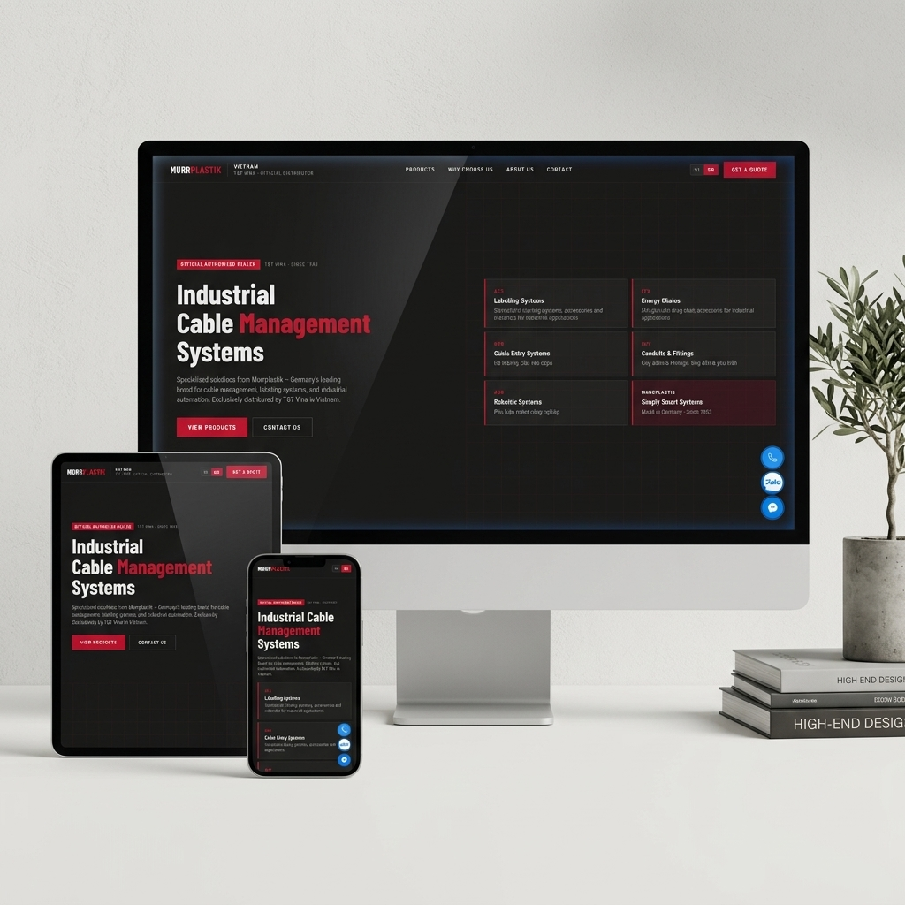

# Murrplastik Việt Nam ([murrplastikvn.com](https://murrplastikvn.com))

Dự án phát triển trang thông tin và giới thiệu sản phẩm chính thức của **Murrplastik** tại Việt Nam, đại lý phân phối ủy quyền bởi **T&T Vina Industrial Co., Ltd**.

Website chính thức: [https://murrplastikvn.com](https://murrplastikvn.com)



Trang web giới thiệu các giải pháp quản lý cáp, ống dẫn, máng xích nhựa, đầu vào cáp và phụ kiện robot hàng đầu từ tập đoàn Murrplastik GmbH (Đức).

---

## 🚀 Các Tính Năng Nổi Bật

### 1. Trải Nghiệm Người Dùng (UI/UX)
*   **Giao diện Hiện đại**: Phối màu đen/đỏ/xám đặc trưng thương hiệu Murrplastik, sử dụng font Barlow chuẩn SEO, hỗ trợ Responsive hoàn hảo trên Mobile, Tablet và Desktop.
*   **Popup CTA Khuyến mãi**: Popup quảng cáo thông minh kích hoạt tự động theo 3 phương thức: cuộn trang quá 25%, ở lại trang 10 giây, hoặc di chuyển chuột rời trang (Exit-Intent). Đi kèm cookie suppression giới hạn hiển thị 1 lần/ngày.
*   **Nút Quay về đầu trang**: Nút điều hướng "Back to Top" thiết kế bo tròn mượt mà, tự động hiển thị khi cuộn quá 50% trang.

### 2. Hệ Thống Đa Ngôn Ngữ (i18n)
*   Tích hợp đa ngôn ngữ Việt - Anh (VI/EN) thông qua engine `assets/js/i18n.js`.
*   Tự động lưu trạng thái lựa chọn ngôn ngữ qua `localStorage` (`mp_lang`).
*   Hỗ trợ dịch thuật toàn diện trên trang chủ và cả 5 trang con chi tiết sản phẩm bao gồm cả thẻ tiêu đề `<title>` và thẻ mô tả `<meta name="description">` chuẩn SEO.

### 3. Tối Ưu Hóa & Hiệu Năng (Performance)
*   **Hình ảnh thế hệ mới & Chống xê dịch CLS**: 100% hình ảnh sản phẩm và banner quảng cáo được tối ưu hóa sang định dạng `.webp`/WebP thế hệ mới. Khai báo rõ ràng thuộc tính `width` và `height` cho tất cả ảnh chính để triệt tiêu xê dịch bố cục (CLS) khi tải trang.
*   **Triệt tiêu Forced Reflow (Layout Thrashing)**: Tối ưu các sự kiện cuộn chuột (`scroll`) bằng cách cache tọa độ phần tử (`offsetTop`, `scrollHeight`), tránh trình duyệt tính toán lại layout liên tục.
*   **Tải tài nguyên bất đồng bộ**: Preload Google Fonts bất đồng bộ và thêm thuộc tính `defer` vào các file JavaScript không thiết yếu nhằm tránh chặn hiển thị (render-blocking resources).
*   **Cấu hình máy chủ (.htaccess)**:
    *   **Gộp chuyển hướng**: Tối ưu hóa chuỗi chuyển hướng HTTP -> HTTPS và WWW -> Non-WWW về 1 bước duy nhất để giảm TTFB.
    *   Kích hoạt nén **Gzip** giảm dung lượng truyền tải mạng.
    *   Cấu hình **Browser Caching** lưu bộ nhớ đệm trình duyệt 1 năm cho ảnh, CSS và JS.
    *   **Cache Busting**: Sử dụng mã phiên bản `?v=1.6.0` tại các link liên kết tài nguyên để ép buộc trình duyệt cập nhật giao diện mới nhất.

### 4. Form Liên Hệ & Theo Dõi Chuyển Đổi
*   **Real-time Validation**: Kiểm tra định dạng Họ tên, Số điện thoại (VN), Email ngay khi nhập liệu.
*   **Google Sheets Integration**: Gửi dữ liệu yêu cầu báo giá trực tiếp về bảng tính Google Sheets thông qua API Google Apps Script.
*   **Đo lường chuyển đổi**: Tích hợp sự kiện `generate_lead` của Google Analytics 4 (GA4) và sự kiện `PageView` của Facebook Pixel khi gửi form thành công.

### 5. Tối Ưu Hóa Kỹ Thuật SEO & GEO (Technical SEO & Search Experience)
*   **Hỏi Đáp Thường Gặp & Schema FAQPage**: Bổ sung khu vực Accordion FAQ giải đáp thắc mắc về năng lực phân phối chính hãng, thời gian giao hàng và chính sách bảo hành. Tích hợp dữ liệu có cấu trúc `FAQPage` (JSON-LD) chuẩn Google để xuất hiện dạng Rich Snippets trên trang kết quả tìm kiếm và nâng cao chỉ số GEO (Generative Engine Optimization) cho AI search engines.
*   **Sitemap & Thẻ Canonical**: Hệ thống `sitemap.xml` và thẻ `<link rel="canonical">` được cấu hình đầy đủ cho toàn bộ trang con, giúp Google Bot lập chỉ mục nhanh chóng và tránh rủi ro trùng lặp nội dung (Duplicate Content).
*   **Hreflang & Schema Breadcrumb**: Cấu hình định tuyến ngôn ngữ `<link rel="alternate" hreflang="vi/en">` và dữ liệu cấu trúc `BreadcrumbList` dạng JSON-LD để hiển thị kết quả tìm kiếm phân cấp chuyên nghiệp.
*   **Schema Product**: Toàn bộ trang sản phẩm được đánh dấu dữ liệu cấu trúc `Product` (Schema.org), giúp tối ưu hóa ưu tiên hiển thị trên Google Shopping và Google Hình Ảnh.
*   **Social Media Preview**: Bổ sung hệ thống thẻ Open Graph và Twitter Cards, đảm bảo link khi chia sẻ qua Zalo, Facebook, LinkedIn luôn hiển thị ảnh đại diện và tiêu đề gọn gàng.
*   **Theme Color Mobile**: Cấu hình thẻ `<meta name="theme-color" content="#C8102E">` đồng bộ màu thanh địa chỉ trình duyệt trên di động với màu đỏ thương hiệu Murrplastik.

### 6. Bảo Mật & Hệ Thống Quản Trị (ECC AgentShield Standard)
*   **Server-side PHP Authentication**: Toàn bộ luồng xác thực đăng nhập `/admin/` được xử lý ở backend PHP 8.3. Mật khẩu được mã hóa một chiều bằng thuật toán **Bcrypt (Cost 12)**, tuyệt đối không lộ thông tin xác thực trên mã nguồn client-side (F12).
*   **Session Bảo Mật & Anti-Brute-Force**: Cookie phiên làm việc được gắn cờ `HttpOnly`, `SameSite=Strict`, `Secure`. Hệ thống tự động khóa IP 15 phút nếu nhập sai quá 5 lần liên tiếp.
*   **Tự Động Purge Cache Máy Chủ**: Script triển khai `deploy_production.py` tự động kích hoạt `X-LiteSpeed-Purge` và xóa OPcache máy chủ Hostinger ngay khi tải file hoàn tất.

---

## 📂 Cấu Trúc Thư Mục Dự Án

```text
├── index.html                  # Trang chủ chính (Tích hợp FAQ & Schema FAQPage)
├── .htaccess                   # File cấu hình máy chủ Apache / LiteSpeed (redirect, anti-cache HTML, security)
├── purge_cache.php             # Endpoint tự động thanh lọc bộ nhớ đệm máy chủ Hostinger CDN
├── robots.txt                  # Hướng dẫn bot công cụ tìm kiếm
├── sitemap.xml                 # Sơ đồ trang web hỗ trợ SEO Google
├── CHANGELOG.md                # Nhật ký cập nhật phiên bản
├── README.md                   # Tài liệu hướng dẫn dự án (File này)
├── deploy_production.py        # Script tự động đồng bộ FTP TLS & Auto-Purge Cache lên Hostinger
├── admin/                      # Hệ thống quản trị nội bộ bảo mật cao (PHP Backend)
│   ├── .htaccess               # Chặn truy cập trực tiếp file cấu hình & thư mục
│   ├── config.php              # Cấu hình bảo mật và Bcrypt password hash
│   ├── auth.php                # REST API xác thực đăng nhập, kiểm tra phiên, chống brute-force
│   ├── index.php               # Giao diện đăng nhập an toàn
│   └── dashboard.php           # Dashboard quản lý sản phẩm nội bộ (Yêu cầu session xác thực)
├── products/                   # Thư mục chứa các trang con chi tiết sản phẩm
│   ├── tem-nhan-va-he-thong-dan-nhan.html   # ACS - Tem nhãn & Hệ thống dán nhãn
│   ├── phu-kien-robot-va-tu-dong-hoa.html  # AUR - Phụ kiện Robot & Tự động hóa
│   ├── mang-xich-nhua-luon-cap.html         # EFK - Máng xích nhựa (Energy Chains)
│   ├── he-thong-dau-vao-cap-va-gia-do.html  # KDH - Hệ thống đầu vào cáp & Giá đỡ
│   └── ong-luon-day-cap-va-phu-kien.html    # SUV - Ống dẫn & Phụ kiện bảo vệ cáp
├── industries/                 # Thư mục chứa các trang ngành công nghiệp ứng dụng
│   ├── thuc-pham-va-do-uong/   # Trang giới thiệu chuyên sâu ngành Thực phẩm & Đồ uống (F&B)
│   └── san-xuat-o-to/          # Trang giải pháp Dress Pack Robot ngành Sản xuất Ô tô
└── assets/                     # Thư mục tài nguyên tĩnh
    ├── css/
    │   └── main.css            # Stylesheet chính (v2.2.0 - Responsive hoàn hảo trên mọi thiết bị)
    ├── js/
    │   ├── main.js             # Logic điều hướng, popup, menu, scroll
    │   ├── form.js             # Xử lý form, validate và gửi dữ liệu GA4
    │   ├── 3d-viewer.js        # Engine hiển thị và tương tác mô hình 3D CAD WebGL
    │   └── i18n.js             # Bộ từ điển và engine dịch thuật VI/EN
    └── images/                 # Hình ảnh sản phẩm, mockups và tài liệu
```

---

## 🚀 Hướng Dẫn Tự Động Triển Khai (Deploy)

Dự án đã tích hợp script tự động hóa hoàn toàn quy trình đóng gói và upload lên máy chủ Hostinger:

```bash
# Triển khai lên máy chủ Production & Tự động xóa cache CDN
python deploy_production.py
```

---

## 💻 Chạy Thử Tại Local

Để chạy thử trang web tại local, bạn chỉ cần khởi chạy một local HTTP server bất kỳ tại thư mục gốc của dự án.

**Sử dụng Node.js (nhanh gọn):**
```bash
npx serve
# Hoặc chạy lệnh node thuần khởi tạo server
```

**Sử dụng Python:**
```bash
python -m http.server 3000
```
Sau đó truy cập địa chỉ `http://localhost:3000` trên trình duyệt.

---

## ☁️ Hướng Dẫn Deploy Lên Hostinger / cPanel

Trang web được xây dựng hoàn toàn dưới dạng tĩnh (Static HTML/CSS/JS) nên việc triển khai cực kỳ đơn giản:

1.  Truy cập vào công cụ quản lý File (File Manager) trên Hostinger hPanel hoặc cPanel.
2.  Di chuyển vào thư mục gốc hiển thị website (thường là `public_html`).
3.  Upload toàn bộ các file ở thư mục gốc và thư mục con (`products/`, `assets/`) lên.
4.  **Quan trọng**: Hãy đảm bảo upload cả file ẩn cấu hình `.htaccess` để kích hoạt tự động chuyển hướng bảo mật HTTPS, non-WWW và cấu hình nén/cache của máy chủ.

